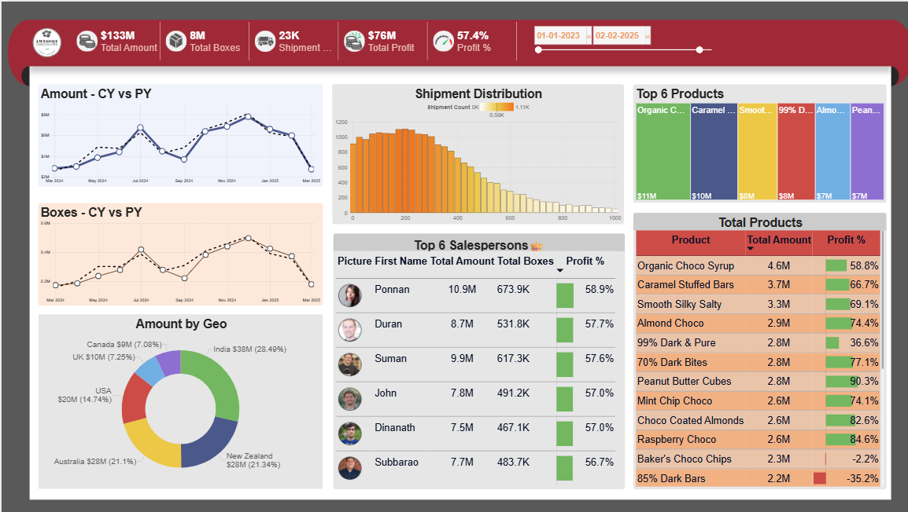

# 🍫 Chocolate Sales Dashboard (Power BI)

## 📊 Overview
This project is a Power BI dashboard developed to analyze sales performance, revenue, and shipment trends using a chocolate company dataset.

## 🎯 Objective
To transform raw sales data into meaningful insights and support data-driven decision-making.

## 🛠️ Tools Used
- Power BI  
- Data Visualization  
- Data Cleaning & Transformation  

## 📈 Key Insights
- Identified top-performing products based on sales and profit  
- Analyzed revenue trends across different regions  
- Evaluated shipment performance over time  

## 📊 Features
- Sales and profit analysis  
- Product-wise performance tracking  
- Trend analysis using charts  

## 📷 Dashboard Preview
Below is a snapshot of the Power BI dashboard:

## 📁 Files Included
- Chocolate_Dashboard.pbix  
- Dataset (Excel file)  

## 🚀 Outcome
This dashboard provides a clear view of business performance and helps in identifying trends for better decision-making.
